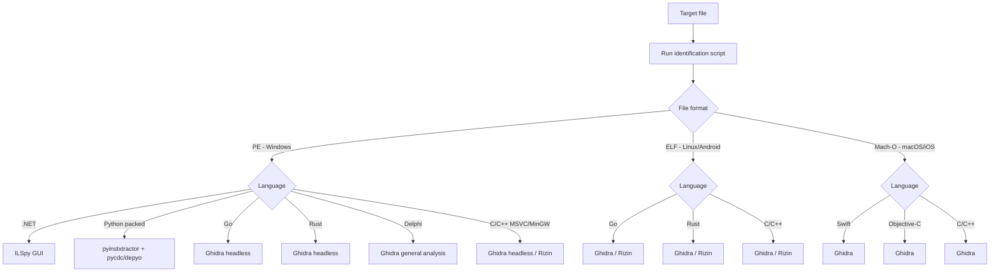

# Binary Reverse Engineering Workflow

A decision-oriented workflow for identifying what a binary is, then routing it to the right
decompiler instead of guessing. Covers PE / ELF / Mach-O, with language-aware tool selection.

> **Paths in this document are placeholders.** Replace `$RE_TOOLS` with the directory where you
> keep your reverse engineering toolchain. Nothing here assumes a particular install location.

---

## 1. Toolchain

### 1.1 Python executable decompilation

| Tool | Install | Python support | Notes |
|------|---------|----------------|-------|
| **depyo** | `npm i -g depyo` | 1.0–3.15 + PyPy | Strongest option; tracks the newest CPython releases |
| **byteripper** | `pip install byteripper` | 3.5–3.14 | Built-in code cleanup, auto-detects version |
| **pycdc** | `$RE_TOOLS/python/pycdc.exe` | 2.x–3.13 | C++ implementation, fast, works offline |
| **uncompyle6** | `pip install uncompyle6` | 2.x–3.8 | Long-standing; most reliable below 3.8 |
| **pyinstxtractor** | `$RE_TOOLS/python/pyinstxtractor.py` | — | Unpacks PyInstaller bundles |

### 1.2 .NET decompilation

| Tool | Install | Notes |
|------|---------|-------|
| **ILSpy (GUI)** | `$RE_TOOLS/ilspy/ILSpy.exe` | Best-in-class .NET decompiler for browsing assemblies |
| **pefile** | `pip install pefile` | PE structure parsing and .NET metadata extraction |

**ILSpy GUI usage:**

```bash
# Launch the GUI, then open the target .dll / .exe from within it
& "$RE_TOOLS/ilspy/ILSpy.exe"
```

> **Note:** the command-line variant `ilspycmd` was not usable in this environment (corrupt NuGet
> package), so the GUI build is the supported path.

### 1.3 C / C++ / Rust native PE

| Tool | Install | Notes |
|------|---------|-------|
| **Ghidra (headless)** | `$RE_TOOLS/ghidra/ghidra_<version>_PUBLIC/` | NSA. Highest decompilation quality; scriptable headless |
| **Rizin** | `$RE_TOOLS/rizin/bin/` | radare2 successor; fast interactive CLI framework |
| **pefile** | `pip install pefile` | PE parsing — imports, sections, compiler detection |

**Rizin essentials:**

```bash
rz-bin -I target.exe      # file structure
rz-bin -i target.exe      # import table
rz-bin -z target.exe      # strings
rz-bin -S target.exe      # sections

rizin -A target.exe       # interactive, with auto-analysis
#   afl         list functions
#   pdf @ main  disassemble a function
#   iz          strings
#   q           quit

echo "afl; q" | rizin -q -A target.exe   # non-interactive
```

**Ghidra headless:**

```bash
# JDK 21+ is required
export JAVA_HOME="$RE_TOOLS/jdk-21"

# Analyse and decompile
& "$RE_TOOLS/ghidra/support/analyzeHeadless.bat" <project-dir> <project-name> \
    -import target.exe -postScript DecompileToStdout.java

# Analyse only
& "$RE_TOOLS/ghidra/support/analyzeHeadless.bat" <project-dir> <project-name> -import target.exe
```

### 1.4 Disassembly engines

| Tool | Install | Purpose |
|------|---------|---------|
| **capstone** | `pip install capstone` | Multi-architecture disassembly (x86 / ARM / MIPS / PPC) |
| **lief** | `pip install lief` | Executable format parsing (ELF / PE / Mach-O / Android) |

```python
# x86-64
from capstone import *
md = Cs(CS_ARCH_X86, CS_MODE_64)
for i in md.disasm(CODE_BYTES, 0x1000):
    print(f"0x{i.address:x}: {i.mnemonic} {i.op_str}")

# ARM
md = Cs(CS_ARCH_ARM, CS_MODE_ARM)
for i in md.disasm(CODE_BYTES, 0x1000):
    print(f"0x{i.address:x}: {i.mnemonic} {i.op_str}")
```

### 1.5 Binary analysis

| Tool | Install | Purpose |
|------|---------|---------|
| **flare-capa** | `pip install flare-capa` | Capability / malicious-behaviour detection (Mandiant) |
| **flare-floss** | `pip install flare-floss` | Obfuscated string extraction (Mandiant) |
| **yara-python** | `pip install yara-python` | Pattern-matching scan rules |
| **pefile** | `pip install pefile` | PE structure parsing |

**capa:**

```bash
capa target.exe          # capability detection
capa -v target.exe       # verbose rule matches
capa -j target.exe       # JSON output
```

**floss:**

```bash
floss target.exe                    # everything, including obfuscated
floss --only decoded target.exe     # decoded strings only
floss --only stack target.exe       # stack strings only
```

**yara:**

```python
import yara

rules = yara.compile(source='''
rule suspicious_calc {
    strings:
        $s1 = "calc.exe" wide nocase
        $s2 = "VirtualAllocEx"
    condition:
        all of them
}
''')

for m in rules.match("target.exe"):
    print(f"rule matched: {m.rule}")
    for s in m.strings:
        print(f"  string: {s}")
```

**lief:**

```python
import lief
b = lief.parse('target.exe')
print(b)
print([i.name for i in b.imports])
print(b.sections)   # useful for packer detection
```

### 1.6 Platform tools

| Tool | Purpose |
|------|---------|
| `file` | Identify file type |
| `strings` | Extract printable strings |
| `objdump` | Disassemble |

---

## 2. Workflow



### Step 1 — Identify the target

```bash
python "$RE_TOOLS/python/identify_binary.py" "target-file"
```

The script reports format, architecture, language/compiler, and the recommended tool with its path.
Route on that result rather than inspecting the header by hand.

<details>
<summary>Example output — .NET</summary>

```text
[1] File format
    Format: PE (Portable Executable) - Windows
    Arch:   x64 (AMD64)

[2] Language / compiler
    Language: .NET
    Build:    C#

[3] Recommended tool
    Tool: ILSpy GUI
    Path: $RE_TOOLS/ilspy/ILSpy.exe
```
</details>

<details>
<summary>Example output — PyInstaller</summary>

```text
[1] File format
    Format: PE (Portable Executable) - Windows

[2] Language / compiler
    Language: Python
    Build:    PyInstaller bundle
    Sections: {'pydata', 'zlib'}

[3] Recommended tool
    Tool: pycdc / depyo
    Path: $RE_TOOLS/python/pycdc.exe
    Usage: unwrap with pyinstxtractor, then decompile the .pyc
```
</details>

<details>
<summary>Example output — Go</summary>

```text
[1] File format
    Format: PE (Portable Executable) - Windows

[2] Language / compiler
    Language: Go
    Compiler: native Go
    Sections: {'.gopclntab', '.go.buildid'}

[3] Recommended tool
    Tool: Ghidra headless
    Path: $RE_TOOLS/ghidra/support/analyzeHeadless.bat
```
</details>

### Step 2 — Route by language

#### Python executable

```text
Condition: language = "Python"
1. Unwrap the PyInstaller bundle
   python "$RE_TOOLS/python/pyinstxtractor.py" target.exe

2. Decompile the .pyc, in priority order
   depyo file.pyc
   byteripper file.pyc -o source.py
   "$RE_TOOLS/python/pycdc.exe" file.pyc > source.py
   uncompyle6 file.pyc > source.py

3. Review the recovered source
```

#### .NET

```text
Condition: language = ".NET"
1. Identify the .NET version
   python -c "import pefile; pe = pefile.PE('target.exe'); print(pe.dump_info())"

2. Decompile
   & "$RE_TOOLS/ilspy/ILSpy.exe"
   Open the target assembly and browse the recovered C#
```

#### Go

```text
Condition: language = "Go"
1. Confirm Go version and build info
   & "$RE_TOOLS/rizin/bin/rz-bin.exe" -I target.exe

2. Extract strings
   floss target.exe

3. Ghidra headless (good Go recovery)
   export JAVA_HOME="$RE_TOOLS/jdk-21"
   & "$RE_TOOLS/ghidra/support/analyzeHeadless.bat" <project-dir> <project-name> -import target.exe

4. Review
   Ghidra recovers goroutine / defer / interface patterns reasonably well.
```

#### Rust

```text
Condition: language = "Rust"
1. PE structure
   python -c "import pefile; pe = pefile.PE('target.exe'); print(pe.dump_info())"

2. Extract strings
   floss target.exe

3. Ghidra headless (decent Rust symbol recovery)
   export JAVA_HOME="$RE_TOOLS/jdk-21"
   & "$RE_TOOLS/ghidra/support/analyzeHeadless.bat" <project-dir> <project-name> -import target.exe

4. Review
   Rust static linking produces a very large function count — start with rz-bin -I
   to understand the overall shape before diving in.
```

#### C / C++

```text
Condition: language = "C/C++" (MSVC / MinGW / Cygwin)
1. PE structure
   python -c "import pefile; pe = pefile.PE('target.exe'); print(pe.dump_info())"

2. Strings, including obfuscated
   floss target.exe

3. Capability detection
   capa target.exe

4. Yara scan
   python -c "import yara; rules = yara.compile(filepath='rules.yar'); print(rules.match('target.exe'))"

5. Decompile
   Complex logic -> Ghidra headless
   Quick interactive look -> Rizin
```

#### Delphi

```text
Condition: language = "Delphi"
1. PE structure
   python -c "import pefile; pe = pefile.PE('target.exe'); print(pe.dump_info())"

2. Strings
   floss target.exe

3. Ghidra general analysis (no dedicated Delphi plugin)
   export JAVA_HOME="$RE_TOOLS/jdk-21"
   & "$RE_TOOLS/ghidra/support/analyzeHeadless.bat" <project-dir> <project-name> -import target.exe

4. Optional: IDR (Interactive Delphi Reconstructor) for Delphi-specific structures
```

#### Firmware / ELF / Mach-O

```text
Condition: format = ELF (Linux/Android) or Mach-O (macOS/iOS)
1. Identify the language
   python "$RE_TOOLS/python/identify_binary.py" "target-file"

2. Strings
   floss "target-file"

3. Yara scan

4. Ghidra handles ELF and Mach-O
   export JAVA_HOME="$RE_TOOLS/jdk-21"
   & "$RE_TOOLS/ghidra/support/analyzeHeadless.bat" <project-dir> <project-name> -import "target-file"
```

---

## 3. Tool selection guide

### `.pyc` decompilation

| Situation | Tool | Command |
|-----------|------|---------|
| Python 3.12+ | **depyo** | `depyo file.pyc` |
| Python 3.9–3.11 | **pycdc** or **depyo** | `pycdc file.pyc > source.py` |
| Python ≤ 3.8 | **uncompyle6** | `uncompyle6 file.pyc > source.py` |
| Obfuscated / encrypted | **byteripper** | `byteripper file.pyc --force` |
| Air-gapped | **pycdc** | `pycdc file.pyc > source.py` |

### Native PE

| Goal | Tool | Why |
|------|------|-----|
| High-quality pseudo-C | **Ghidra headless** | Best decompiler output |
| Interactive exploration | **Rizin** | Fast CLI framework |
| Strings and behaviour only | **floss + capa** | Purpose-built for triage |
| Malware fingerprinting | **yara-python** | Flexible rule matching |
| Structured PE inspection | **pefile + lief** | Programmable |
| Custom disassembly | **capstone** | Multi-arch Python API |

### .NET

| Goal | Tool |
|------|------|
| GUI decompilation | **ILSpy** |
| CLI decompilation | **ilspycmd** (requires .NET SDK) |
| IL only | **ildasm** (.NET SDK) |

---

## 4. Troubleshooting

**`pycdc` fails**
Python version mismatch — `pycdc` does not support 3.12+. Use **depyo** (up to 3.15) or
**byteripper** (up to 3.14).

**`.pyc` corrupt after PyInstaller unpack**
Missing magic number. Copy the first 8 bytes from `struct.pyc` into the target `.pyc`, or use
`depyo --marshal --py-version 3.11 file.pyc`.

**`ilspycmd` install fails**
Corrupt NuGet package — fall back to the ILSpy GUI.

**Ghidra headless**
Requires JDK 21+. Export `JAVA_HOME` before invoking `analyzeHeadless`.

**Rizin**
Use the full path if `bin/` is not on `PATH`. Non-interactive mode:
`echo "cmd; q" | rizin -q`.

---

## 5. Notes

1. **Quote every path** — these install trees routinely contain spaces.
2. **Redirect encoding** — when doing `> source.py` under PowerShell, watch for UTF-8 mangling.
3. **Run unknown binaries in a VM.** This is not optional.
4. **depyo is a Node.js tool** — use `npx depyo` or install globally.
5. **Ghidra needs JDK 21+**; verify `JAVA_HOME` before headless runs.
6. **yara-python vs yara.exe** — the Python package gives you an API; the binary gives you a CLI.
